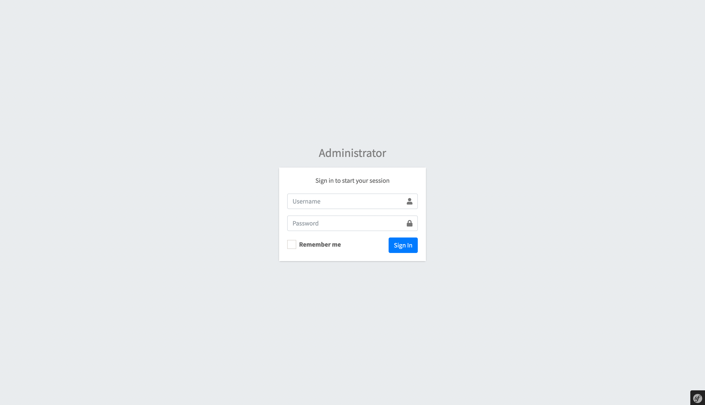
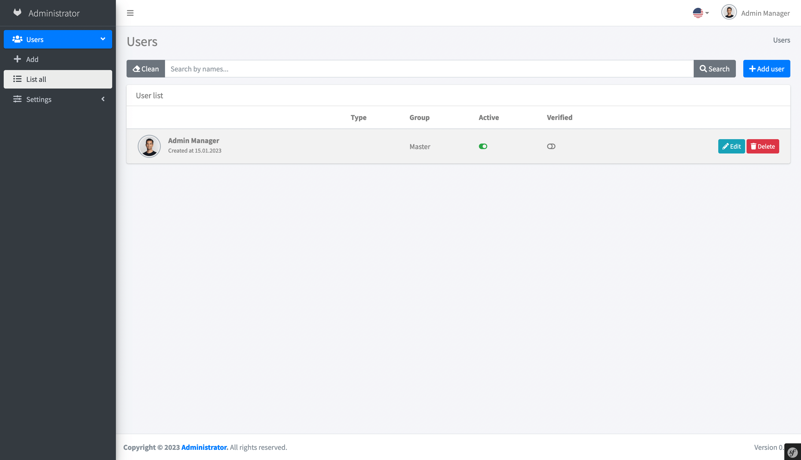
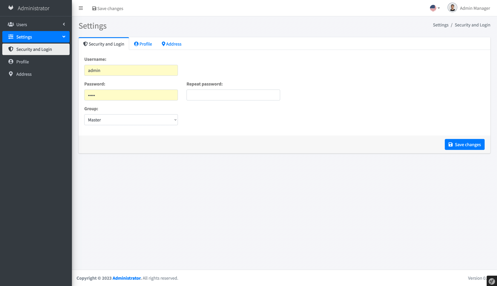
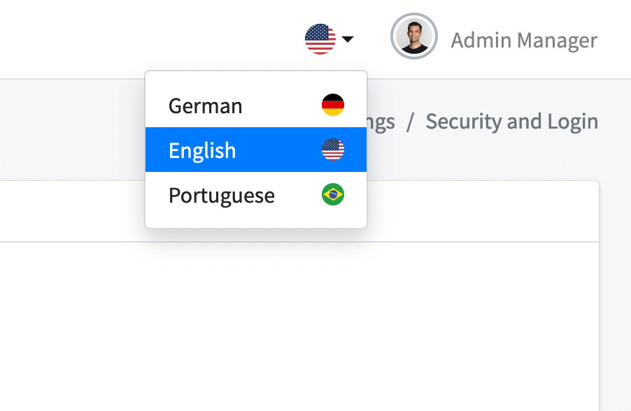

# Symfony Demo Administrator 
This is a simple demo administrator system built in [Symfony 6.1](https://symfony.com/).

## 1 Browser Support

- *Internet Explorer 11 or higher.*
- *Latest versions of Chrome, Firefox, Safari and Windows Edge.*

## 2 Non-functional requirements

*Full responsive.*

## 3 Documentation

- [Changes](CHANGELOG.md)
- [Installation](documentation/installation.md)
- [Databases](documentation/database.md)
- [Commands](documentation/commands.md)

## 4 Screenshots

